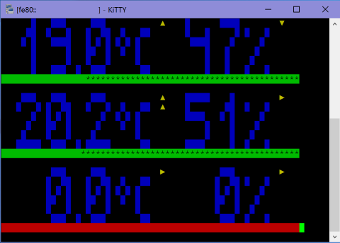

# plview

#### visualize temperature and humidity received by [pilight](https://github.com/pilight/pilight)  
- multiple sensore monitore
- six step tendency display
- receive and validity history
- console, SSH terminal, LCD display
- configurable



#### download  
download repository from GitHub,  
unzip and copy for example to: ~/plview

**or**

check if git is installed  
`$ git --version`

if git is not installed  
`$ sudo apt-get install git-all`

clone repository to current directory  
`$ git clone https://github.com/qrti/plview.git`

- - -

#### preconditions  
[pilight](https://github.com/pilight/pilight) must be installed on your system

pilight config file must contain a datetime device entry

`sudo service pilight stop`
`sudo nano /etc/pilight/config.json`

```
"devices": {
    "currentDateTime": {
        "protocol": [ "datetime" ],
        "id": [{
            "longitude": 21.276281,
            "latitude": 49.292083
        }],
        "year": 2015,
        "month": 10,
        "day": 17,
        "hour": 10,
        "minute": 56,
        "second": 29,
        "weekday": 7,
        "dst": 1
    }
}
```
`sudo service pilight start`

- - -

#### configure  
look for sensors you want to monitor  
`$ pilight-receive -F datetime`

note down their protocol, id and channel  
alter the plview config.ini file for your needs  
restart plview

- - -

#### compile and execute  
change directory  
`$ cd ~/plview`

compile  
`$ make`

execute  
`$ ./plview`

- - -

#### remarks  

Donations are welcome!

[](https://www.paypal.com/cgi-bin/webscr?cmd=_s-xclick&hosted_button_id=E7JNEDMHAJ3TJ)

- - -

#### copyright  
plview is published under the terms of ISC license

Copyright (c) 2016 [qrt@qland.de](mailto:qrt@qland.de)

Permission to use, copy, modify, and/or distribute this software for any purpose with or without fee is hereby granted, provided that the above copyright notice and this permission notice appear in all copies.

THE SOFTWARE IS PROVIDED 'AS IS' AND THE AUTHOR DISCLAIMS ALL WARRANTIES WITH REGARD TO THIS SOFTWARE INCLUDING ALL IMPLIED WARRANTIES OF MERCHANTABILITY AND FITNESS. IN NO EVENT SHALL THE AUTHOR BE LIABLE FOR ANY SPECIAL, DIRECT, INDIRECT, OR CONSEQUENTIAL DAMAGES OR ANY DAMAGES WHATSOEVER RESULTING FROM LOSS OF USE, DATA OR PROFITS, WHETHER IN AN ACTION OF CONTRACT, NEGLIGENCE OR OTHER TORTIOUS ACTION, ARISING OUT OF OR IN CONNECTION WITH THE USE OR PERFORMANCE OF THIS SOFTWARE.
